# 🌊 Prompt Master Extension

> **Your Prompts, All In One Place. Everywhere.**  
> **让您的提示词，随处可见，随时可用**

**English | [中文](README.md)**

A powerful Chrome extension for AI prompt management that helps you save, organize, and optimize your prompts across all AI platforms.

[](https://opensource.org/licenses/MIT)
[](https://chrome.google.com/webstore)
[](https://www.typescriptlang.org/)
[](https://reactjs.org/)

## ✨ Features

### 🚀 Quick Access
- **Instant Activation**: Press `/` on any AI platform to instantly access your prompt library
- **Universal Compatibility**: Works on ChatGPT, Claude, Gemini, and 50+ AI platforms
- **One-Click Insert**: Select and insert prompts with a single click

### 📚 Smart Organization
- **Centralized Library**: All your prompts in one organized location
- **Smart Categories**: Auto-categorize prompts or create custom tags
- **Powerful Search**: Find any prompt instantly with intelligent search
- **Cloud Sync**: Access your prompts across all devices

### 🤖 AI-Powered Optimization
- **Prompt Enhancement**: AI analyzes and suggests improvements to your prompts
- **Performance Metrics**: Track which prompts work best
- **Template Generation**: Create reusable prompt templates
- **Context Awareness**: Prompts adapt to different AI platforms

### 🔄 Seamless Integration
- **Platform Detection**: Automatically detects which AI platform you're using
- **Format Adaptation**: Adjusts prompt format for optimal platform compatibility
- **Batch Operations**: Manage multiple prompts efficiently
- **Export/Import**: Easy backup and sharing capabilities

## 🚀 Quick Start

### For Users

1. **Install the Extension**
   ```bash
   # Download from Chrome Web Store (coming soon)
   # Or build from source (see Development section)
   ```

2. **First-Time Setup**
   - Create your account or sign in
   - Import existing prompts (optional)
   - Start organizing your prompt library

3. **Start Using**
   - Visit any supported AI platform
   - Press `/` to open the prompt selector
   - Choose your prompt and let the magic happen!

### For Developers

1. **Clone the Repository**
   ```bash
   git clone https://github.com/your-username/prompt-master-extension.git
   cd prompt-master-extension
   ```

2. **Setup Environment**
   ```bash
   # Copy environment configuration
   cp .env.example .env.local
   
   # Edit .env.local with your Firebase config
   # See .env.example for detailed instructions
   ```

3. **Install Dependencies**
   ```bash
   # Extension dependencies
   cd extension && npm install
   
   # Backend dependencies  
   cd ../backend && npm install
   ```

4. **Start Development**
   ```bash
   # Start backend server
   cd backend && npm run dev
   
   # Build extension (in another terminal)
   cd extension && npm run build:dev
   
   # Load in Chrome: chrome://extensions/ > Load unpacked > extension/build/
   ```

## 🏗️ Architecture

### System Architecture Overview

Our modern distributed architecture ensures high availability, scalability, and excellent user experience:


### Frontend Component Architecture

```mermaid
graph TB
    subgraph "UI Layer"
        App["📱 App.tsx<br/>Main application entry"]
        LibraryTab["📚 LibraryTab<br/>Prompt library interface"]
        OptimizerTab["🎯 OptimizerTab<br/>Optimization interface"]
        MembershipCenter["⭐ MembershipCenter<br/>Membership management"]
        QuickCommand["⚡ QuickCommand<br/>Quick input component"]
    end

    subgraph "Business Logic Layer"
        usePromptsData["🪝 usePromptsData<br/>Prompt data management"]
        useAuth["🔐 useAuth<br/>Authentication state"]
        useMembership["💎 useMembership<br/>Membership management"]
        useQuota["📊 useQuota<br/>Usage quota tracking"]
        useOptimize["🎯 useOptimize<br/>Optimization features"]
    end

    subgraph "Service Layer"
        StorageService["💾 StorageService<br/>Data storage abstraction"]
        AuthService["🔐 AuthService<br/>Authentication service"]
        OptimizationService["🧠 OptimizationService<br/>AI optimization"]
        MessagingService["📨 MessagingService<br/>Cross-component messaging"]
    end

    subgraph "Data Layer"
        ChromeStorage["🗄️ ChromeStorage<br/>Local storage implementation"]
        CloudStorage["☁️ CloudStorage<br/>Cloud sync implementation"]
        FirestoreListener["🔥 FirestoreListener<br/>Real-time data listener"]
    end

    %% Component relationships
    App --> LibraryTab
    App --> OptimizerTab
    App --> MembershipCenter
    LibraryTab --> usePromptsData
    OptimizerTab --> useOptimize
    MembershipCenter --> useMembership
    usePromptsData --> StorageService
    useAuth --> AuthService
    useOptimize --> OptimizationService
    StorageService --> ChromeStorage
    StorageService --> CloudStorage
    CloudStorage --> FirestoreListener
```



### Core Business Flow Sequence

This sequence diagram demonstrates the complete user journey from trigger to optimization, showcasing our modular design and data flow architecture:

```mermaid
sequenceDiagram
    participant U as 👤 User
    participant CS as 📄 Content Script
    participant BG as ⚙️ Background
    participant SP as 📱 Side Panel
    participant LS as 💾 Local Storage
    participant FS as 🔥 Firestore
    participant API as 🧠 Optimization API
    participant UI as 🎨 Quick Command UI

    Note over U, UI: Scenario: User using quick input on ChatGPT

    %% Phase 1: Trigger Detection
    U->>CS: Types "/" in input field
    CS->>CS: Detects trigger character
    CS->>BG: Sends trigger event
    Note right of CS: Real-time DOM monitoring<br/>Non-invasive detection

    %% Phase 2: Data Retrieval
    BG->>LS: Read local prompt cache
    LS-->>BG: Return cached data
    
    alt Cache hit
        BG->>UI: Display quick selector
    else Cache miss or stale
        BG->>FS: Request cloud data sync
        FS-->>BG: Return latest prompt library
        BG->>LS: Update local cache
        BG->>UI: Display quick selector
    end

    Note over BG, FS: Smart caching strategy<br/>Offline-first, cloud-synced

    %% Phase 3: User Interaction
    UI->>U: Show prompt list
    U->>UI: Search/select prompt
    UI->>BG: Send user selection
    
    %% Phase 4: Data Processing
    BG->>LS: Update usage statistics
    BG->>CS: Send insertion command
    CS->>CS: Replace input content
    CS->>U: Prompt insertion complete

    Note over CS, U: Seamless replacement<br/>Maintains cursor position

    %% Phase 5: AI Optimization Flow (Optional)
    alt User chooses optimization
        U->>SP: Open optimization panel
        SP->>BG: Request optimization service
        BG->>API: Call AI optimization endpoint
        
        Note over API: GPT-4 powered<br/>Multi-strategy optimization
        
        API-->>BG: Return optimization suggestions
        BG->>SP: Display optimization results
        SP->>U: Show comparison and options
        
        opt User confirms optimization
            U->>SP: Confirm optimized version
            SP->>BG: Save optimization result
            BG->>LS: Update local data
            BG->>FS: Sync to cloud
        end
    end

    %% Phase 6: Data Synchronization
    BG->>FS: Async upload usage data
    Note right of FS: User behavior analytics<br/>Personalization data

    Note over U, UI: Complete cycle: Trigger → Retrieve → Select → Insert → Optimize → Sync
```



**Architecture Highlights:**

🎯 **Product Excellence**
- **User-Centric Design**: <200ms response time, offline-first strategy
- **Complete Business Loop**: End-to-end data flow from trigger to sync
- **Robust Error Handling**: Cache fallback, network fault tolerance

🏗️ **Technical Architecture**
- **Modular Decoupling**: Clear component responsibilities, standardized interfaces  
- **Data Flow Control**: Local cache + cloud sync dual protection
- **Performance Optimization**: Smart caching, async processing, batch sync

💼 **Business Value**
- **Usage Analytics**: Data collection for product iteration
- **Personalization Foundation**: User behavior analysis for smart recommendations
- **Monetization Design**: Optimization features as Pro version differentiator

### Technical Stack

**Frontend (Chrome Extension)**
- **Framework**: React 18 with TypeScript
- **Build Tool**: Webpack 5 with Chrome Extension support
- **Styling**: Tailwind CSS for responsive design
- **State Management**: React Context + Hooks
- **Authentication**: Firebase Auth integration

**Backend (API Server)**
- **Runtime**: Node.js with Express.js
- **Language**: TypeScript for type safety
- **Database**: Firebase Firestore
- **Authentication**: Firebase Admin SDK
- **API Design**: RESTful with JSON responses

**Infrastructure**
- **Hosting**: Google Cloud Run (auto-scaling)
- **Database**: Firebase Firestore (NoSQL)
- **Authentication**: Firebase Authentication
- **Storage**: Firebase Storage for assets
- **Monitoring**: Google Cloud Monitoring

## 🛠️ Development

### Prerequisites
- Node.js 16+ and npm
- Chrome browser
- Firebase account
- Git

### Project Structure
```
prompt-master-extension/
├── extension/                 # Chrome extension source
│   ├── src/
│   │   ├── components/       # React components
│   │   ├── hooks/           # Custom React hooks  
│   │   ├── services/        # API and Firebase services
│   │   └── utils/           # Utility functions
│   ├── public/              # Static assets
│   └── manifest.json        # Extension manifest
├── backend/                  # Backend API server
│   ├── src/
│   │   ├── controllers/     # Route controllers
│   │   ├── services/        # Business logic
│   │   ├── middleware/      # Express middleware
│   │   └── utils/           # Utility functions
│   └── config/              # Configuration files
├── docs/                     # Documentation
├── scripts/                  # Build and deployment scripts
└── tests/                    # Test suites
```

### Available Scripts

**Extension Development**
```bash
cd extension
npm run dev          # Development build with watch
npm run build        # Production build
npm run build:dev    # Development build
npm run test         # Run tests
npm run lint         # Lint code
```

**Backend Development**
```bash
cd backend  
npm run dev          # Start development server
npm run build        # Build for production
npm run start        # Start production server
npm run test         # Run tests
npm run lint         # Lint code
```

### Testing

```bash
# Run all tests
npm run test

# Run extension tests
cd extension && npm test

# Run backend tests  
cd backend && npm test

# Run E2E tests
npm run test:e2e
```

## 🤝 Contributing

We welcome contributions! Please see our [Contributing Guide](CONTRIBUTING.md) for details.

### Ways to Contribute
- 🐛 Report bugs
- 💡 Suggest new features
- 🛠️ Submit code improvements
- 📖 Improve documentation
- 🌍 Help with translations

### Development Process
1. Fork the repository
2. Create a feature branch
3. Make your changes
4. Add tests and documentation
5. Submit a pull request

## 🌟 Supported Platforms

| Platform | Status | Notes |
|----------|--------|-------|
| ChatGPT | ✅ Full Support | All features available |
| Claude | ✅ Full Support | All features available |
| Google Gemini | ✅ Full Support | All features available |
| Bing Chat | ✅ Full Support | All features available |
| Character.AI | ✅ Supported | Basic features |
| Poe | ✅ Supported | Basic features |
| 50+ Others | ✅ Supported | Basic prompt insertion |

## 📊 Roadmap

### Current Version (v1.0)
- ✅ Core prompt management
- ✅ Universal "/" shortcut
- ✅ Cloud synchronization
- ✅ Basic AI optimization

### Upcoming Features (v1.1-v1.2)
- 🔄 Advanced prompt templates
- 🔄 Team collaboration features
- 🔄 Prompt performance analytics
- 🔄 Mobile companion app

### Future Vision (v2.0+)
- 🔮 AI-native prompt generation
- 🔮 Cross-platform desktop app
- 🔮 Enterprise team features
- 🔮 API for third-party integrations

## 📄 License

This project is licensed under the MIT License - see the [LICENSE](LICENSE) file for details.

## 🙋‍♂️ Support

- 📖 **Documentation**: Check our [docs](./docs/) folder
- 💬 **Discussions**: Use GitHub Discussions for questions
- 🐛 **Bug Reports**: Open an issue with the bug template
- 💡 **Feature Requests**: Open an issue with the feature template
- 📧 **Direct Contact**: reach out for sensitive matters

## 🎉 Acknowledgments

- Thanks to all contributors who help make this project better
- Inspired by the amazing AI community and their prompt-sharing culture
- Built with love for developers, content creators, and AI enthusiasts

---

**Made with ❤️ by the Aetherflow Team**

*Simplifying AI prompt management, one shortcut at a time.*

---

**English | [中文](README.md)** 